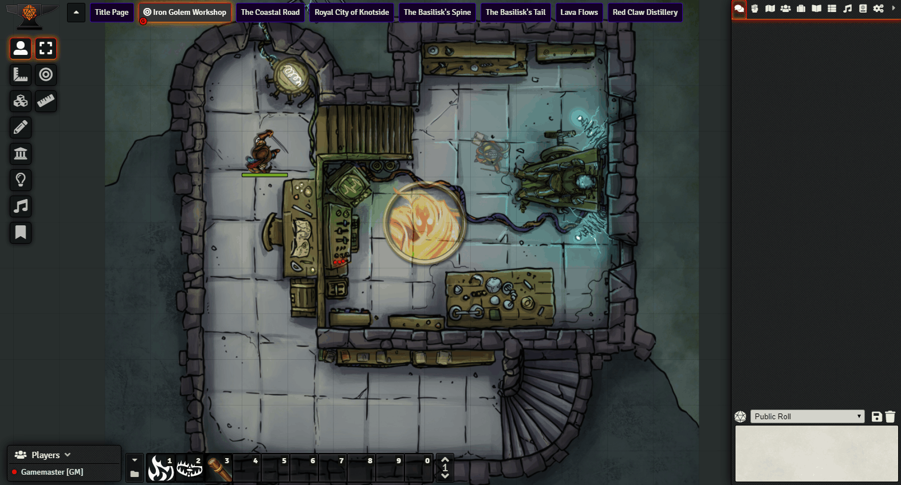
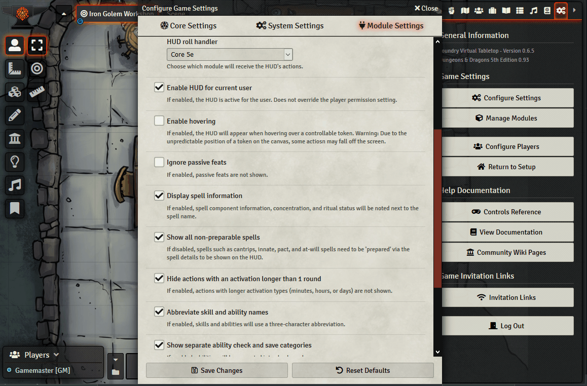
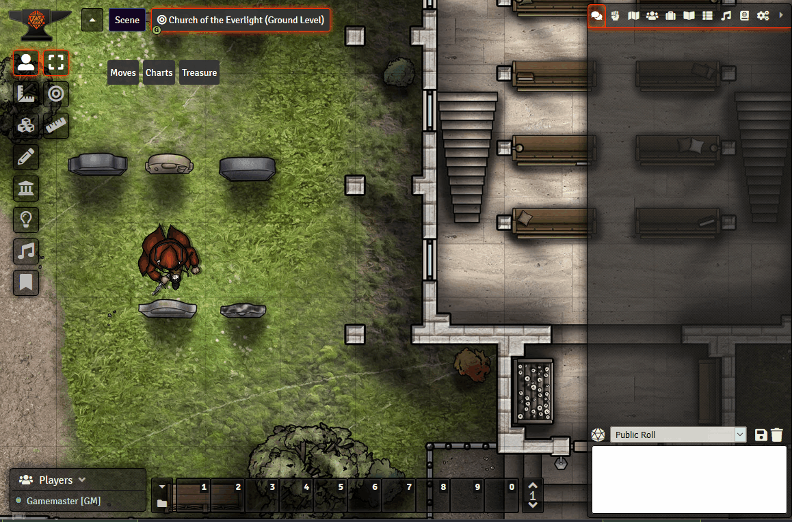
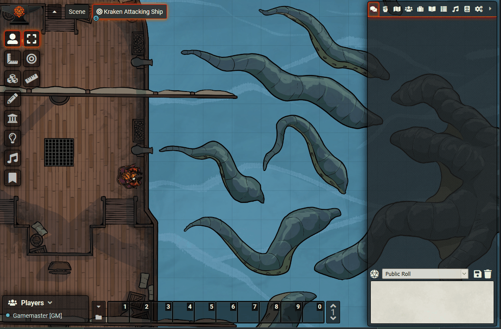
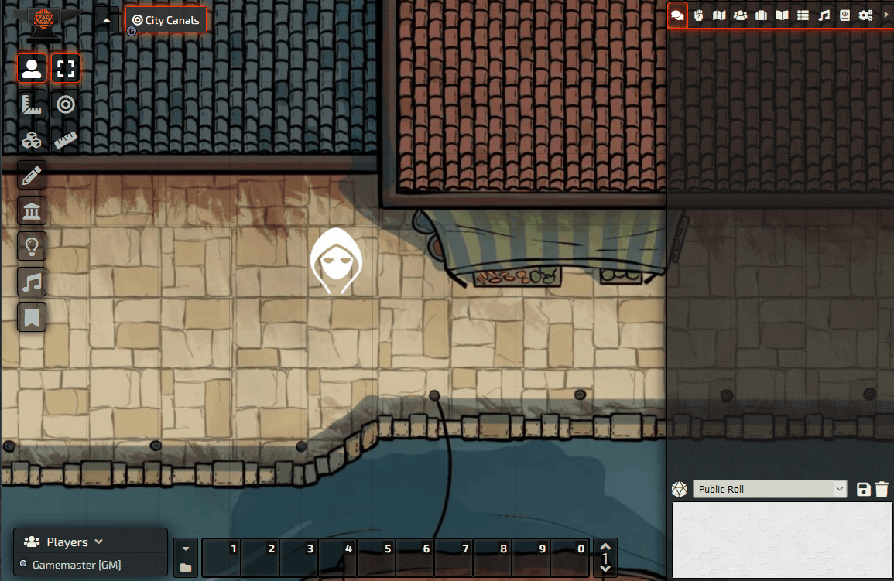

# NOTICE (3 Jul 2021) - UPCOMING NEW MAINTAINER / NEW REPO

**Drental** / https://github.com/Drental/fvtt-tokenactionhud

Due to a number of work and personal developments I am finding it impossible to keep up with the demands of the module and the various systems it currently supports. Drental has very kindly agreed to fork the repo and take over the ongoing development of the HUD.

If anyone would be interested in supporting them by working on any of the system-specific HUD subsystems (or any other contribution) I am sure they would welcome it.

Thank you to everyone who has submitted bug reports, suggestions, and particularly pull requests, all of which have contributed to the success of the HUD so far. Apologies also to everyone who has been affected by the slow pace of updates recently and the issues I've been unable to tackle.

# Token Action HUD

This module populates a repositionable HUD showing the most common basic actions for a selected token. Currently the HUD supports DND5e, WFRP4e, Dungeon World, Pathfinder 2E, Pathfinder 1E, Star Wars FFG, Star Wars 5e, Shadow of the Demonlord (thanks to Xacus#7239) and SFRPG (thanks to Rainer#5041), Tormenta20 (thanks to mclemente#5524).

# Installation

1. Inside Foundry's Configuration and Setup screen, go to **Add-on Modules**
2. Click "Install Module"
3. or in the Manifest URL field paste: `https://github.com/espositos/fvtt-tokenactionhud/raw/master/module.json`
4. Within the game, click on **Settings** -> **Manage Modules** and make sure the Token Action Hud is enabled.

# Usage

Once activated, selecting a token that has an actor/character sheet associated with it and that you have permission to control should display an an action bar that is populated with the actions and abilities available for that token. The HUD can be disabled on a per-user basis if so desired.

Offers a variety of settings including support for third-party roll handlers (Please contact me if you'd like to add yours, or improve the functionality of those offered), and can be repositioned.

## Custom Categories

[Using custom categories](custom_categories.md)

## Support for WFRP

## Dungeon World

## Pathfinder 2E

## Starfinder RPG

# Supported systems

- Blades in the Dark
- DND5e (including [MinorQol](https://gitlab.com/tposney/minor-qol), [Magic Items](https://gitlab.com/riccisi/foundryvtt-magic-items/), and [Item Macro](https://github.com/Kekilla0/Item-Macro).
- Dungeon World
- PF2E
- WFRP4e
- SFRPG
- SWRPG
- SotDL
- PF1
- Star Wars FFG
- Tormenta20
- Symbaroum
- Cthulhu Hack
- Chroniques Oubliées
- Lancer
- D35E
- swade
- od6s
- alienrpg
- kamigakari
- tagmar
- ds4
- forbidden-lands
- Any other system? I believe the HUD is modular enough that anyone who understands what the players of their system want and how actions in their system are handled could quickly build it into the HUD. Please contact me if you'd like to add support for your favourite system.

[Developing for your system or module](adding_systems.md)

# Support

For questions, feature requests, or bug reports, feel free to contact me on the Foundry Discord (Drental#7146) or open an issue here directly.

- Feel free to submit pull requests with a justification of your change, or ask me before starting.
- The HUD's layout could do with some love. If you think you can improve things and know how your way around CSS, please get in touch!

# Thanks

First and foremost, thank you to the Community Helpers on Foundry's Discord who provide tireless support for people seeking help with the HUD.
Enormous thanks also goes to the following people for their help in getting the HUD to its current state:
Kekilla, Rainer, Xacus, Giddy, and anyone who has provided advice to any and all of my problems on Discord, as well as all the other developers who make FoundryVTT a joy to use.

# License

This Foundry VTT module is licensed under a [Creative Commons Attribution 4.0 International License](https://creativecommons.org/licenses/by/4.0/).
This work is licensed under [Foundry Virtual Tabletop EULA - Limited License Agreement for module development](https://foundryvtt.com/article/license/).
